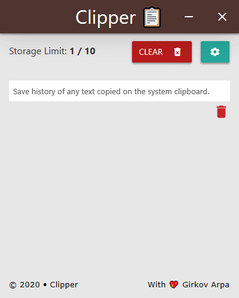

  
<h1 align="center"> Clipper*</h1>  

   *A clone of the original <a href="https://github.com/AkashRajpurohit/clipper">Clipper</a>, a cross-platform clipboard manager, made with <a href="https://github.com/c-smile/sciter-sdk">Sciter</a> instead of Electron.

 

## Backstory

I thought it would be nice to have a concrete example of the same app made with Electron versus Sciter.
So I cloned [Clipper](https://github.com/AkashRajpurohit/clipper) in Sciter to the best of my ability.

The original as an Electron app is `165`mb.

In contrast, the Sciter release is only `6`mb (`3`mb compressed).

I used [Quark](https://quark.sciter.com/) (Sciter's equivalent of [electron-builder](https://www.electron.build/)) to pack the program's resources into a single executable, and [here](https://github.com/GirkovArpa/clipper-sciter/releases) is the result.  I've only packaged for Windows at the moment.

Not only is the filesize over a magnitude of order lighter, but it starts up way faster and without an empty gray window at the beginning.

## Caveats

- I haven't implemented the button click waves effect from the [Materialize](https://materializecss.com/waves.html) CSS library (yet).

- I haven't implemented the tray icon (yet).

- ~~Inactive, offscreen popups can be scrolled into view.~~ **Fixed!** Thanks to a pull request from [4silvertooth](https://github.com/4silvertooth).

I would like to emphasize that this not a port, but (my attempt at) a clone. Since the original Clipper is written in React, a genuine port would utilize Sciter's [Reactor](https://sciter.com/developers/sciter-docs/reactor-and-ssx/).

## Usage

Run [`scapp.exe`](https://github.com/c-smile/sciter-sdk/tree/master/bin.win/x64) in this folder.

## Packaging

Follow the Quark instructions [here](https://quark.sciter.com/quark-application-samples/hello-world/), but use this repository as the source folder instead of the hello world sample.